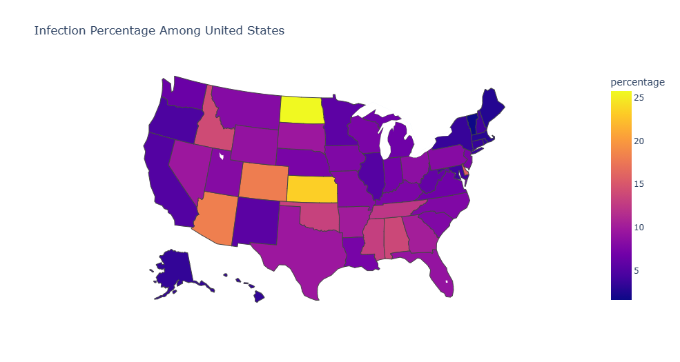
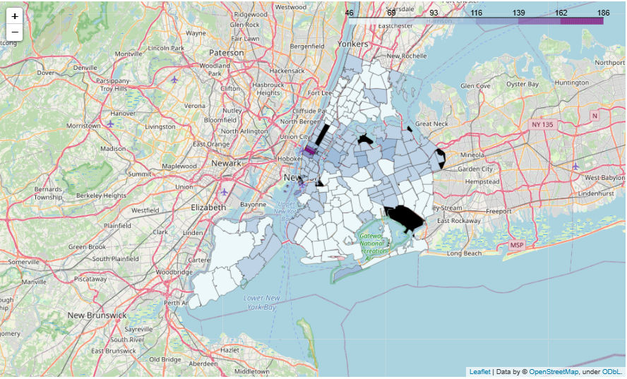
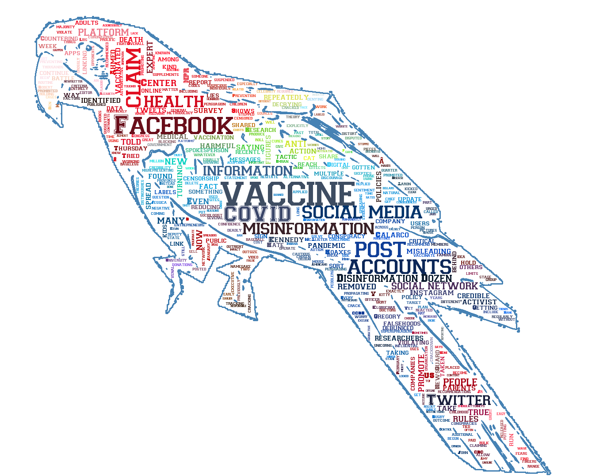

# Analysis-of-COVID-19-Influence-on-USA-through-Geosptial-Visualization



This is a statistical analysis of COVID-19 Influence on USA, mainly on economy. We generate some business insights for the COVID-19's siuation and main influence on economy by visualization and statistical analysis such as clustering.

## Requirements
The work are mainly finished in Python. The dependencies can be installed using the following command:
```bash
pip install -r requirements.txt
```
## Geography Visualization & Word Cloud for COVID-19 Situation Among USA
The main part of work is Visualizing COVID-19 Situation on map with statistical features, such as population, confirmed cases and vaccination percentage. Sometimes, we need to calculate some features from the data, such as obtaing infectious rate, which can be better than confirmed cases to demonstrate COVID-19 Situation in one region, by using population and confirmed cases. 

Also, this part of analysis contains the scope from the whole USA by states, then to New York state and California by counties and finally to New Yoek City by zipcode:
- The whole USA by states
- New York state and California by counties
- New York City by zipcode (city-wise)

The below picture is one of the visualization for NYC Vaccination by zipcode : 


Another work is using WordCloud Visualization for a popluar topic: Misinformation - Vaccine Hoaxes. This part use WordCloud to see how some people share anti-vaccine misinformation on social media platforms



